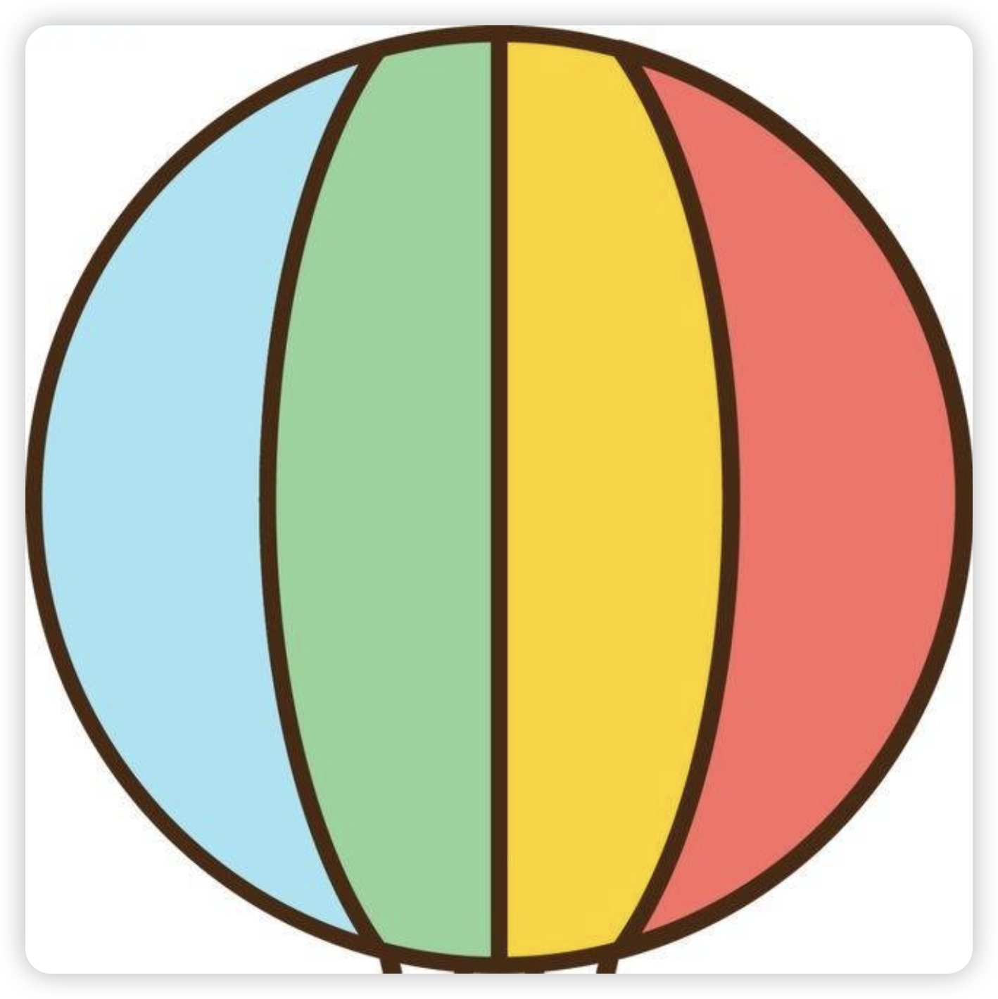

<div align="center">

<a href="http://marsview.cc/"></a>

# Marsview 低代码平台

让搭建更简单，让开发更高效

[项目文档](http://docs.marsview.cc/) |
[开源仓库](https://github.com/JackySoft/marsview) |
[交流群](https://marsview.cdn.bcebos.com/qrcode.jpg)

</div>

<div align="center">


</div>

## 介绍 🚀

Marsview 是一款中后台方向的低代码可视化搭建平台，开发者可以在平台上创建项目、页面和组件，支持事件交互、接口调用、数据联动和逻辑编排等，开发者还可通过微服务快速集成到自己的业务系统中。

## 在线使用 🛸

- 🌍 [Marsview](http://www.marsview.cc/)

|                                    |                                    |
| ---------------------------------- | ---------------------------------- |
|  |  |
|  |  |
|  |  |
|  |  |

## 特色 💥

- **项目：**
  项目配置（主题色、菜单布局、系统 Logo、面包屑...）、完整的 RBAC 的权限管理。
- **页面：** 页面创建、页面主题、页面配置、组件拖拽、样式配置、事件流配置、逻辑编排、接口配置。
  页面支持通过微服务的方式集成到传统项目中，无论你是 Vue 还是 React。
- **权限：** 项目和页面支持开发者和访问者权限配置，项目还支持菜单、按钮级别的 RBAC 控制。
- **自定义组件：** 当平台提供的组件满足不了需求时，可以自定义开发业务组件，平台会在线编译，上传到云端，同时在编辑器界面自定义组件中可以点击进行加载。
- **接口：** 接口统一管理，全局拦截器、返回结构修改等。支持 GET、POST、PUT、DELETE 等请求方式，支持接口动态参数传递。
- **事件流：** 通过事件流可以完成高难度的业务逻辑编排，比如：组件联动、组件显隐、组件禁用、自定义逻辑处理、接口调用、路由跳转等。
- **环境：** 平台支持三套环境，STG、PRE 和 PRD，页面只有发布到对应环境后，才可以在用户端访问到该页面。
- **回滚：** 平台发布后的页面支持一键回滚。
- **微服务：** 如果你是传统的 Vue 项目，想使用此平台，可以先在平台搭建一个页面发布到 PRD 环境，最后通过微服务集成进来。

## 本地开发 👨‍💻

```bash
# 克隆代码
git clone https://github.com/JackySoft/marsview.git
```

### 快速开始

运行需要 node 环境，建议`node:18`以上版本。使用`pnpm`作为依赖管理工具，如未安装，请先执行安装命令`npm install -g pnpm`。

```bash
# 进入根目录
cd marsview

# 安装依赖（安装依赖时间如过长，请先配置镜像源）
pnpm i
# 启动编辑器
pnpm start:editor
# 启动用户端（用户端是当你页面搭建完成后，给用户提供独立访问的系统）
pnpm start:admin
```

### 同步代码

项目处于高速开发阶段，版本更新较快，建议开发者 `fork` 和 `clone` 项目后，设置上流远程分支，随时拉取最新代码同步本地。

```bash
# 添加上流分支

git remote add upstream https://github.com/JackySoft/marsview

# 抓取源仓库修改 master 分支

git fetch upstream main

# 切换分支

git checkout main

# 合并远程分支

git merge upstream/main
```

## 活动记录 🆕

- 2024-08-30: MarsView 发布在[阮一峰周刊](https://www.ruanyifeng.com/blog/2024/08/weekly-issue-315.html)
- 2024-08-27: MarsAI v1.0 上线，在自定义编写中实现辅助生成代码
- 2024-08-17: 项目[在线文档](http://docs.marsview.cc/)发布
- 2024-08-13: 开源文章登上掘金论坛热榜第一
- 2024-08-10: 项目开源
  - 公告项目开源，发布开源文章：[我的低代码平台 Marsview 终于开源了](https://juejin.cn/post/7401009128204894244)
- 2024-07-16: 项目首次在掘金论坛预告
  - 发布预告文章：[我花了 8 个月，做了一款高颜值零代码平台 Mars](https://juejin.cn/post/7392071348480835595)

## 更新日志 📅

查看 [更新日志](https://github.com/JackySoft/marsview/blob/master/CHANGELOG.md) 获取最新更新情况。

## 项目交流 🏘️

在使用和开发过程中遇到任何问题，欢迎微信扫码添加项目交流群：


## 参与捐赠 ✨

[请我喝杯咖啡 ☕️](https://afdian.com/a/marsview)

感谢以下兄弟的捐赠：

| 名称            | 头像                                            |
| --------------- | ----------------------------------------------- |
| 物联网方案-肖工 |  |
| 🥕 二月贝弋 🥕  |  |
| 猩猩点灯        |  |
| 元次达          |  |
| IoT-Fast        |  |
| w10752842       |  |

## 🤝 参与贡献

这个项目的存在感谢项目中所有的贡献者。

我们非常欢迎各种形式的贡献。如果你对贡献代码感兴趣，可以查看我们的 GitHub [Issues](https://github.com/JackySoft/marsview/issues?q=is%3Aissue+is%3Aopen+sort%3Aupdated-desc)，大展身手，向我们展示你的奇思妙想。

如何你想成为开发者，欢迎提交`PR`，提交`PR`规范请参考：[Pull Rquest](.github/PULL_REQUEST_TEMPLATE.md)

<a href="https://github.com/JackySoft/marsview/graphs/contributors" target="_blank">

</a>

## Star History 🌟

如果你发现此项目对你有所帮助，请考虑在 [GitHub](https://github.com/JackySoft/marsview) 上给它一个 ⭐️ !
<a href="https://github.com/JackySoft/marsview/stargazers" target="_blank" style="display: block" align="center">
<picture>

<source media="(prefers-color-scheme: dark)" srcset="https://api.star-history.com/svg?repos=JackySoft/marsview&type=Date&theme=dark" />
<source media="(prefers-color-scheme: light)" srcset="https://api.star-history.com/svg?repos=JackySoft/marsview&type=Date" />

</picture>
</a>

## 许可证 📄

此项目根据 MIT 许可证授权 - 有关详细信息，请参阅 [LICENSE](https://github.com/JackySoft/marsview/blob/main/LICENSE) 文件。
