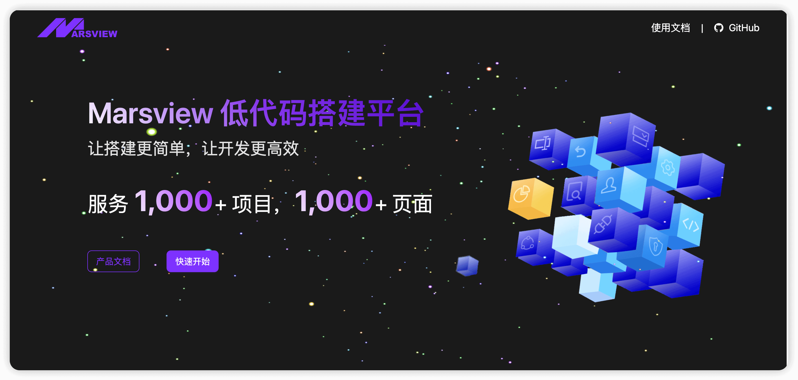
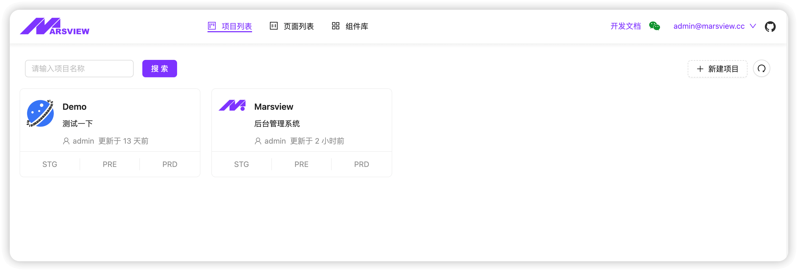
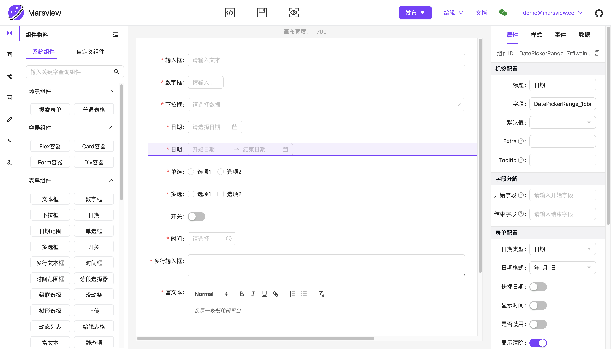
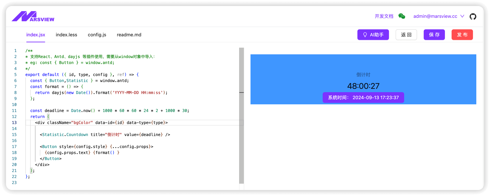
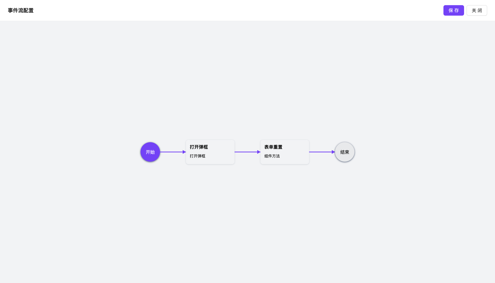
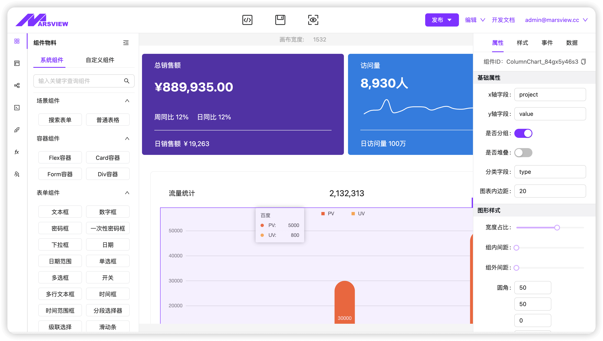
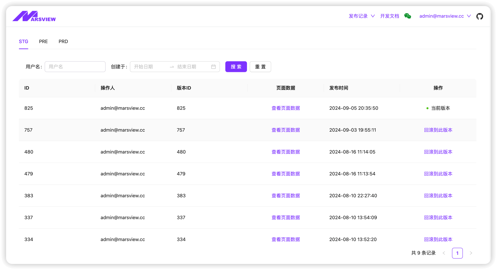
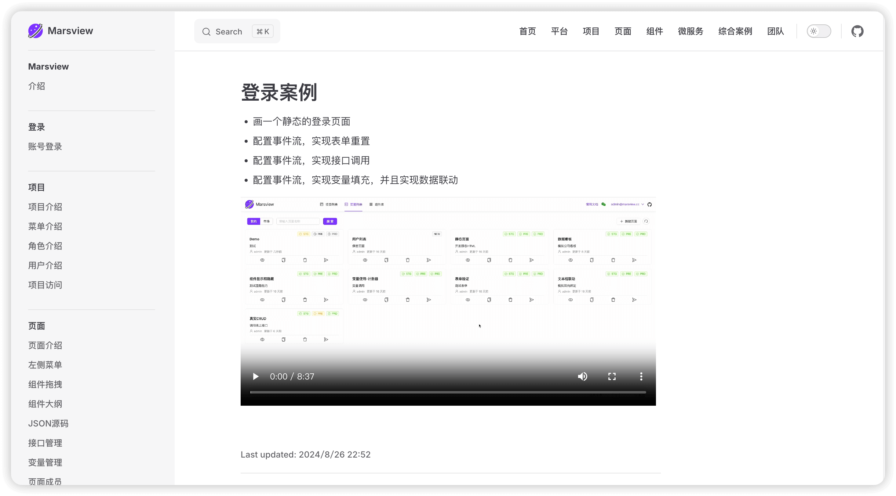

<div align="center">

<a href="http://marsview.cc/"></a>

# Marsview Low Code Platform

Make building simpler and development more efficient

[Project documentation](http://docs.marsview.cc/) |
[Open source repository](https://github.com/JackySoft/marsview) |
[Communication group](./.github/imgs/mywechat.jpg)

</div>

<div align="center">


English | [中文](./README.zh-CN.md)

</div>

## Intro 🚀

Marsview is a low code visualization platform for middle and backend development. Developers can create projects, pages, and components on the platform, supporting event interaction, interface calling, data linkage, and logical orchestration. Developers can also quickly integrate them into their own business systems through the microApp front-end framework.

> > > > > > > 4ac0c61 (feat: 添加中英文 readme)

## Online use 🛸

- 🌍 [Marsview](http://www.marsview.cc/)

|                                    |                                    |
| ---------------------------------- | ---------------------------------- |
|  |  |
|  |  |
|  |  |
|  |  |

## Platform Features 💥

- **project:**
  Project configuration (theme color, menu layout, system logo, breadcrumbs...), complete RBAC permission management.
- **page:** Page creation, page theme, page configuration, component drag and drop, style configuration, event flow configuration, logical orchestration, interface configuration.
  The page supports integration into traditional projects through microservices, whether you are Vue or React.
- **permission:** The project and page support developer and visitor permission configuration, and the project also supports RBAC control at the menu and button level.
- **Custom Components:** When the components provided by the platform cannot meet the requirements, business components can be customized and developed. The platform will compile them online and upload them to the cloud. At the same time, in the editor interface, custom components can be loaded by clicking on them.
- **interface:** Unified interface management, global interceptors, return structure modifications, etc. Support GET, POST, PUT, DELETE and other request methods, and support dynamic parameter passing through interfaces.
- **event flow:** High difficulty business logic orchestration can be completed through event flow, such as component linkage, component visibility and concealment, component disabling, custom logic processing, interface calling, route jumping, etc.
- **environment:** The platform supports three environments, STG, PRE, and PRD. The page can only be accessed on the user side after being published to the corresponding environment.
- **rollback：** After the platform is released, the page supports one click rollback.
- **Micro front-end integration:** If you are a traditional Vue project and want to use this platform, you can first build a page on the platform and publish it to the PRD environment, and finally integrate it through microservices.
- The backend provides two versions, JAVA and Koa, with MySQL as the database.
  > > > > > > > 4ac0c61 (feat: 添加中英文 readme)

## Local development 👨‍💻

```bash
git clone https://github.com/JackySoft/marsview.git
```

### 快速开始

Running requires a node environment, it is recommended to have a version of 'node: 18' or higher. Use `pnpm` as a dependency management tool. If it is not installed, please execute the installation command `npm install - g pnpm` first.

```bash
# 进入根目录
cd marsview

# Install dependencies (if the installation dependency time is too long, please configure the image source first)
pnpm i
# 启动编辑器
pnpm start:editor
# 启动用户端（用户端是当你页面搭建完成后，给用户提供独立访问的系统）
pnpm start:admin
```

> Note: Vite_SBASEAPI can also choose to use an online address,eg: VITE_BASE_API = http://mars-api.marsview.cc/api.

### Synchronization Code

The project is in a high-speed development stage with fast version updates. It is recommended that developers set up upstream remote branches after the fork and clone projects to pull the latest code and synchronize it locally at any time.

```bash
# add upstream

git remote add upstream https://github.com/JackySoft/marsview

# Capture the source repository and modify the main branch

git fetch upstream main

# Switch Branch

git checkout main

# Merge remote branches

git merge upstream/main
```

## Activities 🆕

- 2024-08-30: MarsView 发布在[阮一峰周刊](https://www.ruanyifeng.com/blog/2024/08/weekly-issue-315.html)
- 2024-08-27: MarsAI v1.0 上线，在自定义编写中实现辅助生成代码
- 2024-08-17: 项目[在线文档](http://docs.marsview.cc/)发布
- 2024-08-13: 开源文章登上掘金论坛热榜第一
- 2024-08-10: 项目开源
  - 公告项目开源，发布开源文章：[我的低代码平台 Marsview 终于开源了](https://juejin.cn/post/7401009128204894244)
- 2024-07-16: 项目首次在掘金论坛预告
  - # 发布预告文章：[我花了 8 个月，做了一款高颜值零代码平台 Mars](https://juejin.cn/post/7392071348480835595)
- 2024-10-30: Marsview open-source backend service.
- 2024-09-27: Online email registration service.
- 2024-08-30: MarsView Published in [Ruan Yifeng Weekly](https://www.ruanyifeng.com/blog/2024/08/weekly-issue-315.html)
- 2024-08-27: MarsAI v1.0 is launched, and auxiliary code generation is implemented in custom writing.
- 2024-08-17: Project [Online Document](http://docs.marsview.cc/) Publish.
- 2024-08-13: Open source article ranks first on the hot list of the Gold Mining Forum.
- 2024-08-10: Project open source
  - Announce project open source, publish open source article: [My low code platform Marsview is finally open source](https://juejin.cn/post/7401009128204894244)
- 2024-07-16: The project is previewed for the first time on the Gold Mining Forum
  - Release trailer article: [I spent 8 months creating a high-quality zero code platform called Mars](https://juejin.cn/post/7392071348480835595)

## Update log 📅

View [Update Log](https://github.com/JackySoft/marsview/blob/master/CHANGELOG.md) Get the latest updates.

## Project communication 🏘️

If you encounter any technical or commercial authorization issues during use, please feel free to contact me via WeChat:


## Participate in donation ✨

[Please treat me to a cup of coffee ☕️](https://afdian.com/a/marsview)

Thank you to the following brothers for their donation:

| name            | profile picture                                               |
| --------------- | ------------------------------------------------------------- |
| 物联网方案-肖工 |  |
| 🥕 二月贝弋 🥕  |  |
| 猩猩点灯        |  |
| 元次达          |  |
| IoT-Fast        |  |
| w10752842       |  |
| 朱红宾          |  |

## 🤝 Participate and contribute

We warmly welcome contributions in various forms. If you are interested in contributing code, you can check out our GitHub [Issues](https://github.com/JackySoft/marsview/issues?q=is%3Aissue+is%3Aopen+sort%3Aupdated-desc),Show us your creativity and creativity.

How do you want to become a developer? Welcome to submit `PR`. Please refer to the `PR` specification for submission: [Pull Rquest](.github/PULL_REQUEST_TEMPLATE.md)

<a href="https://github.com/JackySoft/marsview/graphs/contributors" target="_blank">

</a>

## Star History 🌟

If you find this project helpful to you, please consider [GitHub](https://github.com/JackySoft/marsview) Give it one ⭐️ !
<a href="https://github.com/JackySoft/marsview/stargazers" target="_blank" style="display: block" align="center">
<picture>

<source media="(prefers-color-scheme: dark)" srcset="https://api.star-history.com/svg?repos=JackySoft/marsview&type=Date&theme=dark" />
<source media="(prefers-color-scheme: light)" srcset="https://api.star-history.com/svg?repos=JackySoft/marsview&type=Date" />

</picture>
</a>

## licence 📄

This project is authorized under the MIT License - for more information, please refer to [LICENSE](https://github.com/JackySoft/marsview/blob/main/LICENSE) the document.
